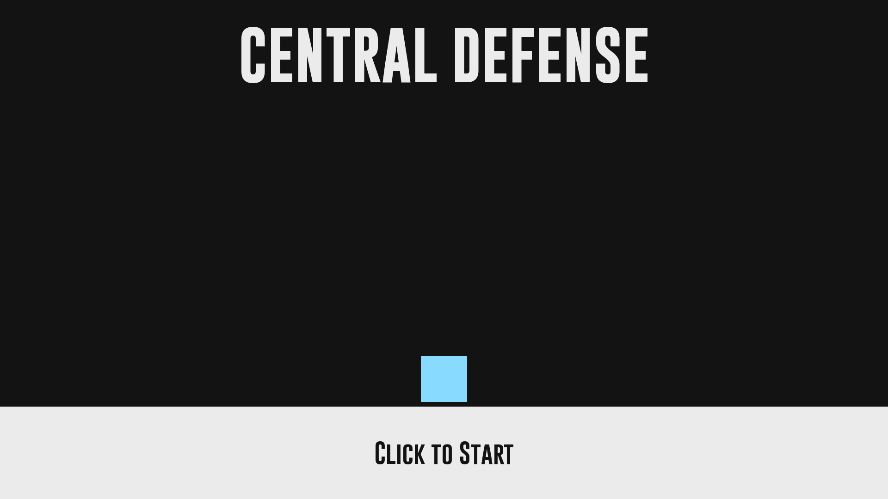
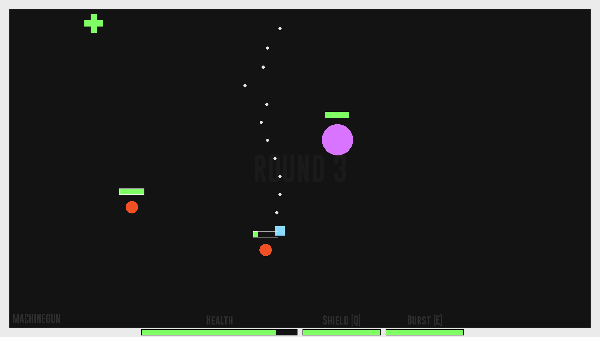
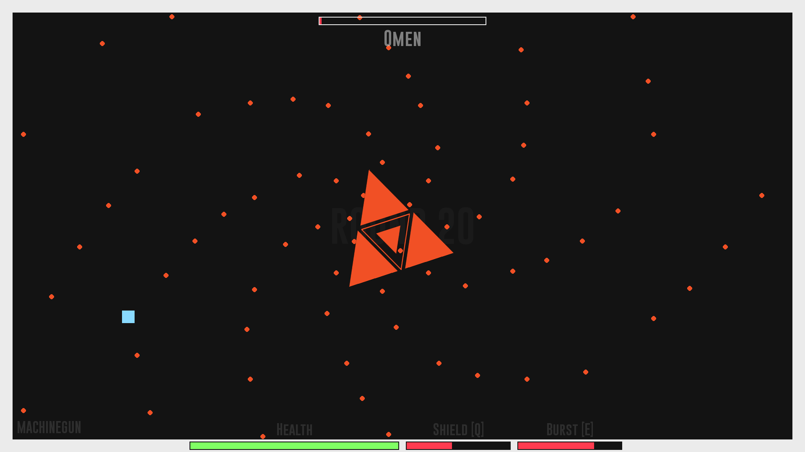

# Central Defense

A combination of bullet hell, horde, and rhythm in a single game.

## Controls

| Input           | Action                     |
| --------------- | -------------------------- |
| `W` `A` `S` `D` | Move up, left, down, right |
| `SPACE`         | Dash                       |
| `ESC`           | Pause                      |
| `E`             | Burst                      |
| `Q`             | Shield                     |
| `Hold LMB`      | Shoot toward mouse pointer |
| `RMB`           | Switch ranged weapon       |

## Preview

